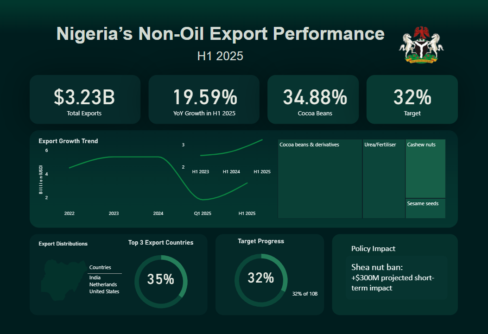

# 🇳🇬 Nigeria’s Non-Oil Export Performance Dashboard (H1 2025)

A data visualization project analyzing **Nigeria’s Non-Oil Export Performance for H1 2025**, highlighting growth trends, sector contributions, target progress, and policy impact insights.

---

## 📊 Project Overview

This dashboard presents a strategic view of Nigeria’s non-oil export sector, focusing on:

- **Total Exports:** $3.23B  
- **Year-on-Year Growth:** 19.59%  
- **Cocoa Beans Contribution:** 34.88%  
- **Target Achievement:** 32%

The goal is to transform export performance data into a clear, executive-level visual narrative that supports policy analysis and economic strategy discussions.

---

## 🎯 Objectives

- Track export growth trends over time  
- Identify top-performing commodities  
- Monitor export target progress  
- Highlight key export destinations  
- Assess short-term policy impact  

---

## 📌 Key Insights

### 1️⃣ Export Growth Trend
- Strong recovery trajectory in H1 2025.
- Temporary dip observed in Q1 2025 before rebound.
- Positive YoY growth of **19.59%**, signaling sector resilience.

### 2️⃣ Commodity Contribution
- **Cocoa beans & derivatives** dominate exports (34.88%).
- Other major contributors:
  - Urea/Fertiliser
  - Cashew nuts
  - Sesame seeds

### 3️⃣ Top Export Destinations
- India  
- Netherlands  
- United States  

These markets remain critical drivers of non-oil revenue.

### 4️⃣ Target Progress
- 32% of the annual export target achieved by H1 2025.
- Indicates moderate alignment with strategic economic goals.

### 5️⃣ Policy Impact
- Shea nut ban projected to add **$300M short-term impact**.
- Demonstrates how regulatory shifts can influence export performance.

---

## 🛠 Tools & Technologies

- Power BI  

---

## 📈 Why This Project Matters

Nigeria’s economic diversification depends heavily on strengthening non-oil exports. This dashboard:

- Bridges raw data with policy interpretation  
- Supports economic decision-making  
- Demonstrates applied data analysis skills  
- Showcases executive-level visualization design  

---

## 🚀 Skills Demonstrated

- Data Cleaning & Transformation  
- KPI Design  
- Time-Series Analysis  
- Economic Insight Interpretation  
- Dashboard Design & Visual Communication  

